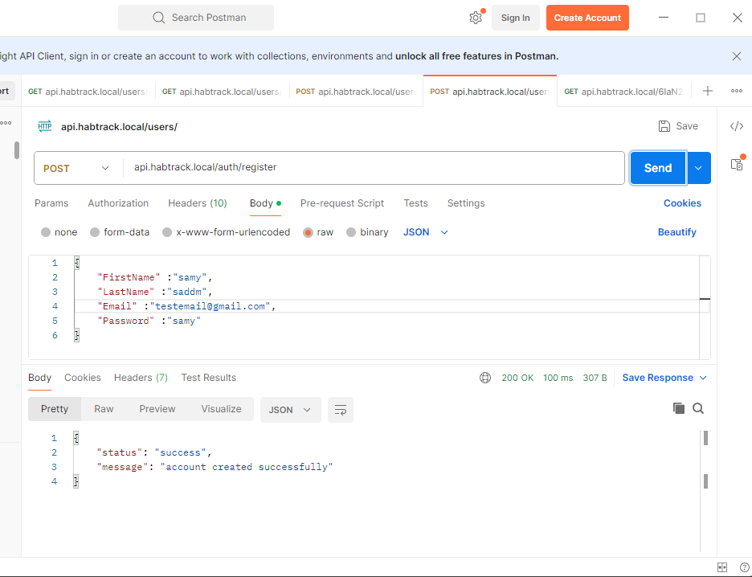
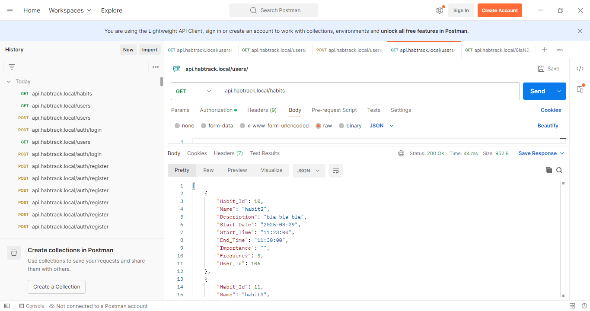
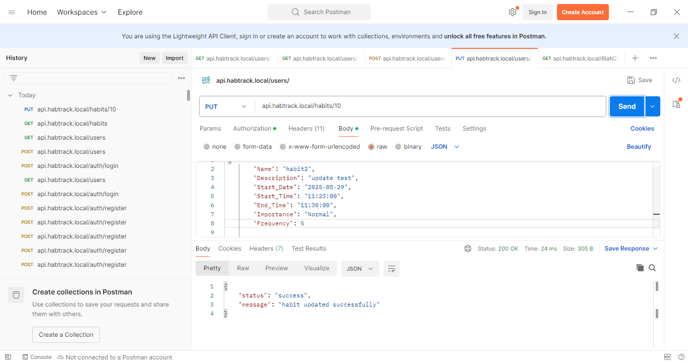
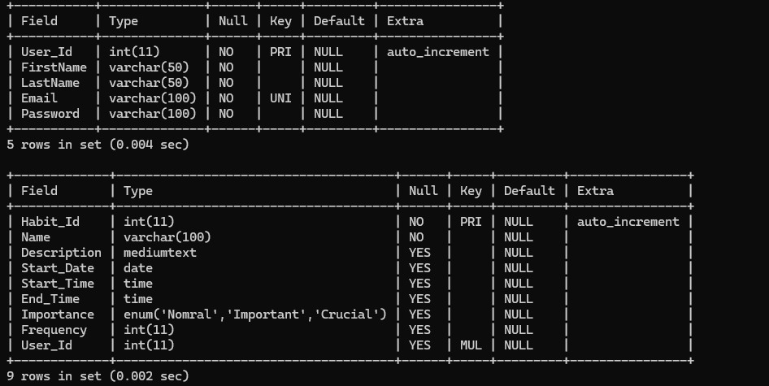
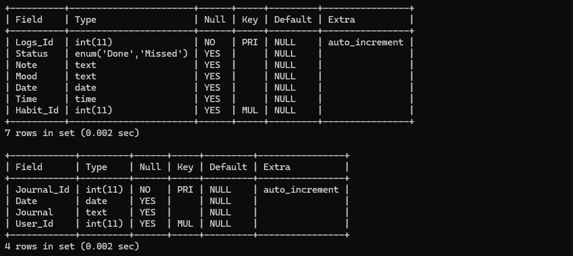
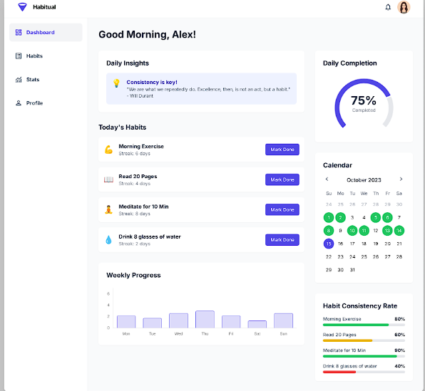

# Habit Tracker (Full-Stack Project)

## 📌 Project Status: Backend Complete ✅ | Frontend Pending 🚧  

This project is a **full-stack habit tracker** with a **modern backend architecture in PHP + MySQL** and a planned **frontend in Vanilla JS, HTML, and CSS**.  

---

## ✅ Current Progress: Backend (Fully Functional)  

The backend is **fully built, tested, and production-ready**, featuring:  

- 🔐 **Authentication & Authorization**  
  - Implemented with **JWT (JSON Web Tokens)** for stateless authentication.  
  - Secure password hashing & session handling.  
  - **Authorization checks** to ensure users can only access their own habits (ownership enforced).  

- 🌐 **Custom Routing System**  
  - Centralized router to handle API requests (RESTful endpoints).  
  - Supports all CRUD operations for habits & user management.  

- ⚙️ **Error Handling & Logging**  
  - Global error handler for consistent API responses.  
  - Logging system for debugging and monitoring.  

- 🛡️ **Input Validation & Security**  
  - All user inputs are validated and sanitized before database interaction.  
  - Protection against SQL injection, XSS, and common vulnerabilities.  

- 🏗️ **Scalable Architecture**  
  - Built with a **maintainable structure** inspired by modern frameworks:  
    - `Models/` – database interaction  
    - `Controllers/` – business logic  
    - `Middleware/` – request filtering (auth, validation, etc.)  
    - `Core/` – routing, base classes, and helpers  
    - `Config/` – environment and database config  
    - `.env` – environment variables support  

- 🗄️ **Database Design**  
  - Normalized schema with relations for **users and habits**.  
  - Supports streak tracking, completion logs, and analytics.  

- 🧪 **Testing**  
  - Endpoints tested with **Postman**.  
  - All routes verified, backend runs without errors.  

---

## 🚧 Next Steps (Frontend Development)  

- 🎨 Build UI pages: Dashboard, Habits list, Statistics view, Profile.  
- 🔗 Connect UI to backend API for real-time habit tracking.  
- 📊 Add streak calendar + progress charts.  

---

## 🖼️ Screenshots 
- API test results (Postman)
-   
-   
-   
- Database schema design 
- 
- 

  ### pages design / UI mockup (coming soon)
  - ### Dashboard (UI mockup)

---
